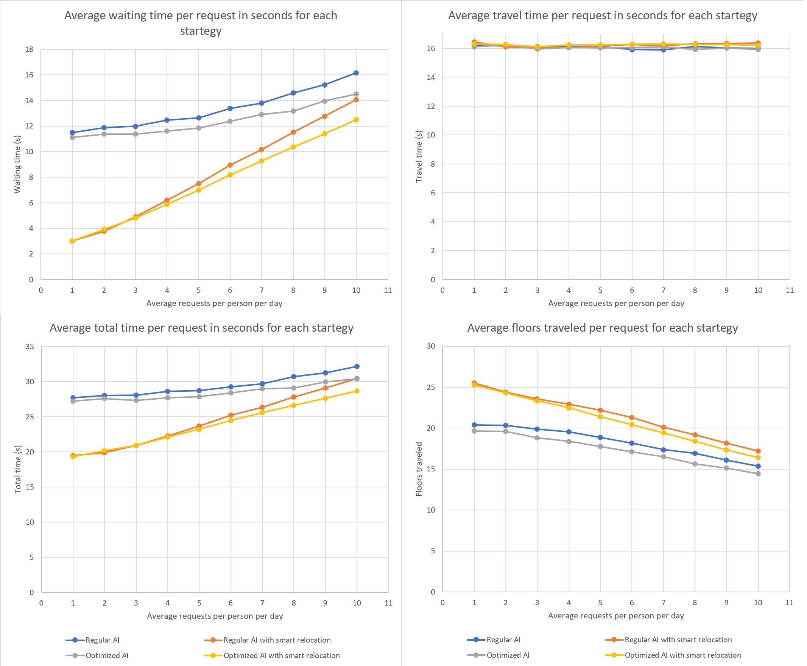
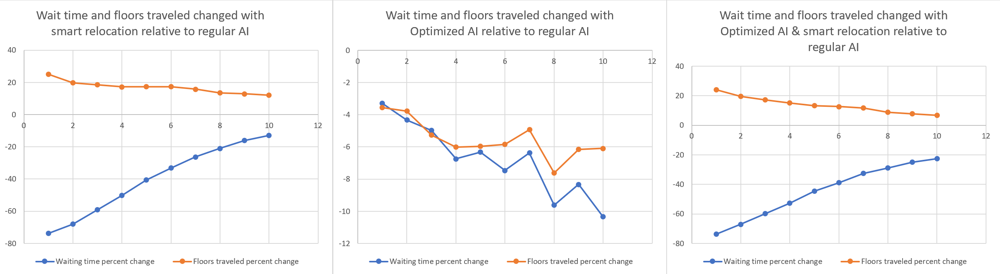

# Elevator Simulator 🏢

This project is a modular simulation of an elevator system inside of a building.
The configuration of the building can be changed freely to run the simulation in different types of buildings with different number of elevators etc...

This project intends on exploring different strategies for the elevators to pick up and drop off requests and tracks three metrics to judge their performances.

A smart relocation that relocates idle elevator dynamically to the give maximum coverage of the building based on requests of the last half hour.
This is a trade-off that can reduce the waiting time of passengers but increase the energy used by the elevator system.

Another strategy used is to give the elevator information about where the destination floor of a request is before the passenger is even picked up. This way, the elevator system can make more complicated decisions since it knows where everyone is going before they even get in the elevator.

## Metrics tracked

**1. Waiting time** ⌚

This is the average time that someone waits from the moment they press the button to request the elevator to the moment the elevator doors open.

**2. Travel time** ✈

This is the average time that someone spends inside the elevator from the moment they step in to the moment the doors open allowing them to leave.

**3. Floors traveled** 📏

This is the average number of floors that the elevator travels to complete one request.

This number will therefore account for the floors traveled while the elevator could be empty on its way to service a request. And if multiple people are in the same elevator, this "cost" is distributed amongst them.

## How accurate is the simulation

The good! 👍

- Takes into account the time that a passenger enters/exists the elevator 
- Distribution of residents per floor is taken into account (Less people live on penthouse floors)
- Request source and destinations are weighted by the floor "interest" (There is a much higher chance that requests come from or go to the ground floor or floors with amenities)
- Day cycles are taken into account (In the morning, people are going to work so requests tend to down to the ground floor and around 5 there is a spike of requests from the ground floor to the apartments after work)

The bad... 👎
- Acceleration of elevators is not taken into account
- Assumption that when a request is made, it is always just one person
- Capacity of elevators is not taken into account (They can accommodate as many passengers as needed)
- Assumption that nobody accidently presses more than their destination floor

## Different AIs

Two different elevator AI's have been implemented: a baseline, and an optimized version

### Regular AI

A standard elevator AI from my observations in my apartment building.

The logic is simple:
 - If there are some idle elevators, the closest one is assigned to go service the request.
 - If there are no idle elevators, check if any busy elevator could service the request on its way. If there exist any of these elevators, the closest one should service the request.
 - If neither of the above conditions are true, continue the simulation until the request can be serviced.
 
### Optimized AI

The optimized AI is given information about where the destination floor of the requests are without having to pick up the passenger.

The decision making follows this penalty minimization logic:

````
for each elevator
  if elevator idle
    penalty = wait time
  else if request on the way
    penalty = wait time + loading time (number of people waiting for and in this elevator)
  else
    penalty = time the elevator will take to service its current requests and come back
  
chose the option with the least penalty
````

## Smart relocation

The smart relocation is a plugin system that can be plugged to any elevator AI. It tracks the distribution of requests that were made in the last half hour.
When an elevator is done servicing all its requests and becomes idle, it calculates its most optimal positioning in the building relative to the other elevators such that the waiting time for any new request is minimized (weighted by floor based on probability).
The probability distribution for new requests is approximated by the distribution that was tracked over the last half hour.

## Results

The below results were ran with the following configuration:


Simulation days : ````25````

Ticks per day: ````86400	````

Number of elevators: ````3	````

Number of building floors: ````34	````

Elevator speed per tick: ````1	````

Loading time in ticks: ````5	````

Residents per floor: ````[24, 24, 24, 24, 24, 24, 24, 24, 24, 24, 24, 24, 24, 24, 21, 21, 21, 21, 21, 19, 19, 19, 19, 19, 19, 19, 16, 16, 14, 14, 14, 14, 12, 10]````

Interest per floor: ````[7, 1, 1, 1, 1, 1, 1, 1, 1, 1, 1, 1, 1, 1, 1, 1, 1, 1, 1, 1, 1, 1, 1, 1, 1, 1, 1, 4, 1, 1, 1, 1, 1, 1]````


<p align="center">
  
</p>

When the elevator has knowledge of the destination of the requests without having to pick them up, it can make more optimized decisions to minimize the target metrics. As we can see, the optimized AI is able to shave off a bit of waiting time and even reduce the floors traveled for the elevator which reduces the energy usage.

On the other hand, the smart relocation reduces the waiting time by a significant amount. We can see that as the number of requests per person per day increases, the elevators are much busier and dont get to relocate. The curve with the smart relocation then slowly converges towards the curve without the relocation.

Furthermore, we see that both strategies do not have a large impact on the travel time at all.

<p align="center">
  
</p>

The above graph shows the same results as a percentage change relative to the baseline regular AI. We can see that the optimized AI is able to reduce both the waiting time and the floors traveled by a small amount.

The relocation is very interesting. There is a small increase in floors traveled (energy used) but there is also a significant decrease in the waiting time. For example, when using the Optimized algorithm with the smart relocation, for the points at an average requests per person per day of 4 which is fairly realistic. There is an increase in floors traveled (energy used) of only about 13% for a decrease in average waiting time of 53%. Compared to the baseline, we can cut the waiting time in half with a 13% increase in floors traveled (energy used)

This is quite awesome!
